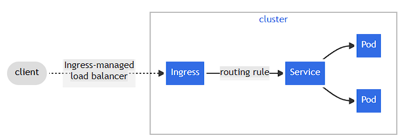

# Kubernetes Cheetsheey by Sourabh Biswas

https://quickref.me/kubernetes

Kubernetes Documentation link: - 

https://kubernetes.io/docs/concepts/

Useful Tips: - 
To Run kubernetes locally in your system 
- Use docker desktop single node cluster kubernetes
- Mini kube single node cluster kubernetes
- Rancher 
  - [Rancher Desktop single node cluster with kubernetes dashboard](https://docs.rancherdesktop.io/getting-started/installation/)
  - [Rancher Server Single Node for linux](https://www.rancher.com/docs/rancher/v1.1/en/installing-rancher/installing-server/)
 

To Run kubernetes production grade cluster in on-prem or cloud instances system
- [kops for production grade Kubernetes cluster ](https://www.youtube.com/watch?v=44Qk55E6CAA&list=PLdpzxOOAlwvJdsW6A0jCz_3VaANuFMLpc&index=5/)
- [Rancher Server Multi Nodes](https://www.rancher.com/docs/rancher/v1.1/en/installing-rancher/installing-server/multi-nodes/)

To Run kubernetes production grade cluster on cloud distribution
- [RED HAT Openshift for production grade kubernetes cluster](https://www.youtube.com/watch?v=vwDezts_aFg&t=15s)
- [AWS EKS production grade k8s](https://www.youtube.com/watch?v=RRCrY12VY_s&list=PLdpzxOOAlwvLm5lWlYctUnwaFRIO2Io_5&index=2&t=2729s&pp=iAQB)
- [Azure AKS production grade k8s](https://youtu.be/akNSPKX0uIA?si=PUKJcGcJW4kQG8Rm)


## Resources of Kubernetes

1. ### [Pod](#detailed-description-of-pod)
2) ### [Service](#detailed-description-of-service)
3) ### [ReplicaSet](#detailed-description-of-replicaset)
4) ### [ConfigMap](#detailed-description-of-configmap)
5) ### [Secrets](#detailed-description-of-secrets)
6) ### [Deployment](#detailed-description-of-deployment) 
7) ### [Namespace](#detailed-description-of-namespace)
8) ### [Volume](#detailed-description-of-volume)
9) ### [Ingress](#detailed-description-of-ingress)
10) ### [Istio, Service meash and Sidecar container](#detailed-description-of-istio)
11) ### [RBAC](#detailed-description-of-rbac)

## Detailed Description of Pod
Pod represents a single instance/server of a running process in your cluster and can contain one or more containers.

 - K8s Pod yml file to create Pod inside k8s

Command to apply yaml in k8s. It can create new resources if they don’t exist or update existing resources to match the configuration in the file.
```bash
kubectl apply -f <name_of_file>
```

Sample Template

```Yaml
apiVersion: v1
kind: Pod
metadata:
  name: my-nginx-pod
  labels:
    app: myapp
spec:
  containers:
  - name: nginx-container
    image: nginx
```


## Detailed Description of Service
Service work on top of Pod. Services enable communication between different components in a Kubernetes cluster, allowing stable networking for Pods even if they are ephemeral(pod are down) and their IP addresses change.

 - K8s Service yml file to create Service inside k8s
Sample Template

```Yaml
apiVersion: v1
kind: Service
metadata:
  name: my-service
spec:
  selector:
    app: myapp
  ports:
  - protocol: TCP
    port: 80
    nodePort: 30001
  type: NodePort
  ```
## Detailed-Description-Of-Replicaset
ReplicaSet ensures a specified number of identical Pods are running at any given time. It provides high availability and scaling by automatically creating or deleting Pods to maintain the desired state.

 - K8s ReplicaSet yml file to create Replicaset inside k8s
Sample Template

```Yaml
# If we have ReplicaSet yaml file then Pod yaml file in not needed
apiVersion: apps/v1       
kind: ReplicaSet          
metadata:
  name: nginx-replicaset  
spec:
  replicas: 3             
  selector:
    matchLabels:          
      app: myapp          
  template:               
    metadata:
      labels:
        app: myapp        
    spec:
      containers:
      - name: nginx       
        image: nginx
```
## Detailed-Description-Of-Configmap

 - Create a ConfigMap from Literal Values

```bash
     # Create a ConfigMap named example-configmap with literal values
     kubectl create configmap example-configmap --from-literal=key1=value1 --from-literal=key2=value2   
```

 - Create a ConfigMap from a File

```bash   
     # Create a file named config.txt with the following content:
     key1=value1
     key2=value2
```

```bash
     # Create a ConfigMap named file-configmap from the file
     kubectl create configmap file-configmap --from-file=config.txt
```
 - Create a ConfigMap from an Environment File

```bash   
     # Create an environment file named env-config.env with the following content:
     ENV_VAR1=value1
     ENV_VAR2=value2
```

```bash
     # Create a ConfigMap named env-configmap from the environment file:
     kubectl create configmap env-configmap --from-env-file=env-config.env
```
 - Create a ConfigMap from Multiple Files
Create multiple files:

config1.txt with content:
```bash   
     key1=value1
```
config2.txt with content:
    
```bash   
     key2=value2
```

```bash
     # Create a ConfigMap named multi-file-configmap from multiple files:

     kubectl create configmap <configmap_name> --from-file=config1.txt --from-file=config2.txt
```
 - Delete command for already available configmap
```bash
     kubectl create configmap multi-file-configmap --from-file=config1.txt --from-file=config2.txt
```
 - Delete command for already available configmap

```bash
     kubectl delete configmap <configmap_name>
```
    OR

```bash
     kubectl delete cm <configmap_name>
```

- K8s ConfigMap yml file to create configmap
Sample Template

```Yaml
apiVersion: v1
kind: ConfigMap
metadata:
  name: <give_the_name_for_configmap>
data:
  key4: val4
  key2: val2
  key3: val3
```
- Pod yml file with ConfigMap to create pod.
Sample Template 

```Yaml
apiVersion: v1
kind: Pod
metadata:
  name: <give_the_name_for_pod>
spec:
  containers:
  - name: <give_the_name_for_container>
    image: <give_image_name_for_container>   
    envFrom:
    - configMapRef:
        name: <enter_already_create-configmap_name>
```

## Detailed-Description-Of-Secrets
Secret is an object used to store sensitive information, such as passwords, OAuth tokens, SSH keys, or any other sensitive data. The purpose of using Secrets is to avoid putting this sensitive information directly in your Pod or Deployment configuration files, which could be exposed.


- Create a secret from literal values

```bash
     kubectl create secret generic <give_name_of_secret> --from-literal username=admin --from-literal password='P@ssw0rd'
```
    Verify the secret:

```bash
    kubectl get secrets <enter_name_of_secret> -o yaml
```
The output will be base64 encoded. To decode, you can use:

```bash
    echo -n “P@ssw0rd” | base64
```

- Create a Secret from a File

Create a file with your sensitive data

username.txt and add content inside the file as: -

```bash
admin
```
password.txt and add content inside the file as: -

```bash
admin@123
```

```bash
     kubectl create secret generic <give_name_of_secret> --from-file username=./username.txt --from-file password=./password.txt
```
    Verify the secret:

```bash
    kubectl get secrets <enter_name_of_secre> -o yaml
```
The output will be base64 encoded.

- Create a YAML file for the secret

```Yaml
apiVersion: v1
kind: Secret
metadata:
  name: my-manifest-secret
type: Opaque
data:
  username: YWRtaW4=    # base64 encoded value of 'admin'
  password: UEBzc3cwcmQ=  # base64 encoded value of 'P@ssw0rd'
```

Apply the YAML file to create secret

```bash
kubectl apply -f my-manifest-secret.yaml
```

- Create a pod that uses the secret:
```Yaml
apiVersion: v1
kind: Pod
metadata:
  name: <give_name_for_pod>
spec:
  containers:
  - name: <give_name_for_container>
    image: <enter_image_name_for_container>
    env:
    - name: USERNAME
      valueFrom:
        secretKeyRef:
          name: <give_name_for_secret>
          key: <key_valuename_like_username>
    - name: PASSWORD
      valueFrom:
        secretKeyRef:
          name: <give_name_for_secret>
          key: <key_valuename_like_password>
```

## Detailed-Description-Of-Deployment
Deployment is a resource used to manage and maintain the desired state of pod during updation of pod. It provides Rolling deployments updates to Pods ensuring your application is running reliably duriing updates. Updates are exposed to an increasing percentage of users incrementally until fully released.

Sample Template for deployment

```Yaml
apiVersion: apps/v1
kind: Deployment
metadata:
  name: <give_name_for_deployment>
  labels:
    app: web
spec:
  replicas: 10
  selector:
    matchLabels:
      app: web
  template:
    metadata:
      labels:
        app: web
    spec:
      containers:
      - name: <give_name_for_container>
        image: <enter_imagename>
```
Roll Back Deployment command. It will restore previously deployment. Previous deployment is saved in k8s.

```bash
kubectl rollout undo deployment <enter_deployment_name>
```

## Detailed-Description-Of-Namespace
A namespace in Kubernetes is a logical partitioning mechanism that allows you to divide a single Kubernetes cluster into multiple virtual clusters. This enables better organization, resource isolation, and management of workloads within the cluster.

Command to create a namespace
```bash
kubectl run nginx --image=nginx --namespace=<insert-namespace-name-here>
```

## Detailed-Description-of-Volume
A Container's file system lives only as long as the Container does. So when a Container terminates and restarts, filesystem changes are lost. For more consistent storage that is independent of the Container, you can use a Volume.


- [Configure a Pod to Use a Volume for Storage](https://kubernetes.io/docs/tasks/configure-pod-container/configure-volume-storage/)

```Yml
#In this exercise, you create a Pod that runs one Container. This Pod has a Volume of type emptyDir that lasts for the life of the Pod, even if the Container terminates and restarts. 
apiVersion: v1
kind: Pod
metadata:
  name: redis
spec:
  containers:
  - name: redis
    image: redis
    volumeMounts:
    - name: redis-storage
      mountPath: /data/redis
  volumes:
  - name: redis-storage
    emptyDir: {}
```

- [Volumes](https://kubernetes.io/docs/concepts/storage/volumes/)
On-disk files in a container are ephemeral, which presents some problems for non-trivial applications when running in containers. One problem occurs when a container crashes or is stopped. Container state is not saved so all of the files that were created or modified during the lifetime of the container are lost. During a crash, kubelet restarts the container with a clean state. Another problem occurs when multiple containers are running in a Pod and need to share files. It can be challenging to setup and access a shared filesystem across all of the containers. The Kubernetes volume abstraction solves both of these problems.

Types of volumes: - 
Persistent Volumes
Projected Volumes
Ephemeral Volumes


## detailed-description-of-ingress

Ingress exposes HTTP and HTTPS routes from outside the cluster to services within the cluster. Traffic routing is controlled by rules defined on the Ingress resource.
You must have an Ingress controller to satisfy an Ingress. Only creating an Ingress resource has no effect.

[Ingress Docs](https://kubernetes.io/docs/concepts/services-networking/ingress/)

[Ingress Controllers](https://kubernetes.io/docs/concepts/services-networking/ingress-controllers/)




```bash
apiVersion: networking.k8s.io/v1
kind: Ingress
metadata:
  name: minimal-ingress
  annotations:
    nginx.ingress.kubernetes.io/rewrite-target: /
spec:
  ingressClassName: nginx-example
  rules:
  - http:
      paths:
      - path: /testpath
        pathType: Prefix
        backend:
          service:
            name: test
            port:
              number: 80
```

## Detailed-Description-of-Istio

- Sidecr Container

Sidecar containers are the secondary containers that run along with the main application container within the same Pod. These containers are used to enhance or to extend the functionality of the primary app container by providing additional services, or functionality such as logging, monitoring, security, or data synchronization, without directly altering the primary application code.

Sidecar containers run alongside app containers in the same pod. However, they do not execute the primary application logic; instead, they provide supporting functionality to the main application.
Sidecar containers have their own independent lifecycles. They can be started, stopped, and restarted independently of app containers. This means you can update, scale, or maintain sidecar containers without affecting the primary application.
Sidecar containers share the same network and storage namespaces with the primary container. This co-location allows them to interact closely and share resources.


Here's an example of a Job with two containers, one of which is a sidecar:

```bash
apiVersion: batch/v1
kind: Job
metadata:
  name: myjob
spec:
  template:
    spec:
      containers:
        - name: myjob
          image: alpine:latest
          command: ['sh', '-c', 'echo "logging" > /opt/logs.txt']
          volumeMounts:
            - name: data
              mountPath: /opt
      initContainers:
        - name: logshipper
          image: alpine:latest
          restartPolicy: Always
          command: ['sh', '-c', 'tail -F /opt/logs.txt']
          volumeMounts:
            - name: data
              mountPath: /opt
      restartPolicy: Never
      volumes:
        - name: data
          emptyDir: {}
```


- [Managing microservices with the Istio service mesh](https://kubernetes.io/blog/2017/05/managing-microservices-with-istio-service-mesh/)

- [Istio Video](https://www.youtube.com/watch?v=eSNetKBe7Z8&list=PLdpzxOOAlwvJdsW6A0jCz_3VaANuFMLpc&index=24)

# Detailed-Description-Of-RBAC
Role-based access control (RBAC) is a method of regulating access to computer or network resources based on the roles of individual users within your organization.

[Doc](https://kubernetes.io/docs/reference/access-authn-authz/rbac/)

Create a Role example
```Yml
# Here's an example Role in the "default" namespace that can be used to grant read access to pods
apiVersion: rbac.authorization.k8s.io/v1
kind: Role
metadata:
  namespace: default
  name: pod-reader
rules:
- apiGroups: [""] # "" indicates the core API group
  resources: ["pods"]
  verbs: ["get", "watch", "list"]
```

ClusterRole example
```Yml
apiVersion: rbac.authorization.k8s.io/v1
kind: ClusterRole
metadata:
  # "namespace" omitted since ClusterRoles are not namespaced
  name: secret-reader
rules:
- apiGroups: [""]
  #
  # at the HTTP level, the name of the resource for accessing Secret
  # objects is "secrets"
  resources: ["secrets"]
  verbs: ["get", "watch", "list"]
```

RoleBinding examples
```bash
apiVersion: rbac.authorization.k8s.io/v1
# This role binding allows "jane" to read pods in the "default" namespace.
# You need to already have a Role named "pod-reader" in that namespace.
kind: RoleBinding
metadata:
  name: read-pods
  namespace: default
subjects:
# You can specify more than one "subject"
- kind: User
  name: jane # "name" is case sensitive
  apiGroup: rbac.authorization.k8s.io
roleRef:
  # "roleRef" specifies the binding to a Role / ClusterRole
  kind: Role #this must be Role or ClusterRole
  name: pod-reader # this must match the name of the Role or ClusterRole you wish to bind to
  apiGroup: rbac.authorization.k8s.io
```

Apply RBCA command

```bash
#Test applying a manifest file of RBAC objects, displaying changes that would be made:
kubectl auth reconcile -f my-rbac-rules.yaml
```

```bash
#Apply a manifest file of RBAC objects, preserving any extra permissions (in roles) and any extra subjects (in bindings):
kubectl auth reconcile -f my-rbac-rules.yaml
```

[RBAC Video](https://www.youtube.com/watch?v=1slRgW2IzJY&list=PLdpzxOOAlwvJdsW6A0jCz_3VaANuFMLpc&index=12)