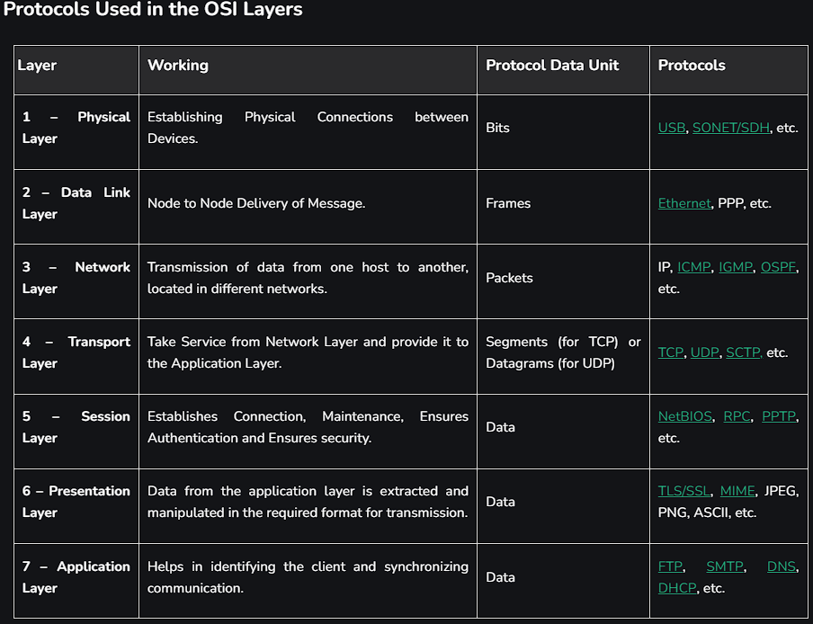

# Networking Fundamentals

- [Networking Explained in a simple way](https://youtu.be/PhTn8RkF0F4?si=S7bHVNDzX5UybJdJ)

- [OSI Model Simplified](https://youtu.be/lomiPKIXdEo?si=9xf4Evvtmm2wl3wi)

https://www.geeksforgeeks.org/computer-network-tutorials/?ref=gcse_ind

- [Real-Time AWS VPC and network project](https://youtu.be/FZPTL_kNvXc?si=VGmgZb1M4WtJToSc)

